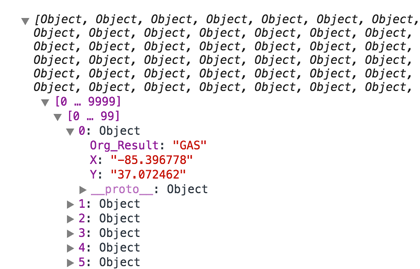
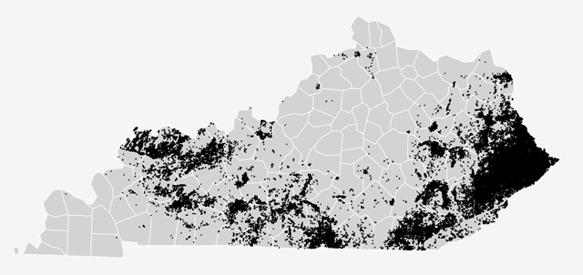
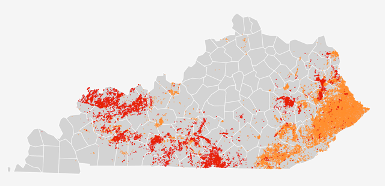

#Introduction to D3.js Web Mapping Through 7 Simple Maps

**[@maptimeLEX](https://twitter.com/maptimelex) 06/24/15**

**Presentation by [@rgdonohue](https://twitter.com/rgdonohue)**

In this @maptimeLex, we (re-)introduce ourselves to the D3.js visualization library and explore its integration within a larger web mapping workflow. Drawing upon Andy Woodruff's (@awoodruff) excellent [@maptimeBoston presentation](http://maptimeboston.github.io/d3-maptime/), we'll explore the library's implementation when used to create seven simple web maps. 

* All the files and data for the examples discussed within this maptime event are hosted at: [maptimelex/d3-mapping](https://github.com/maptimelex/d3-mapping)
* I've also posted working examples as Gists, which can be viewed here: [rgdonohue’s blocks](http://bl.ocks.org/rgdonohue)

Rather than starting from the ground up and slowly building a working web map with D3 &ndash; like many great resources do &ndash; in this maptime we're going to look at simple, complete maps and deconstruct them to better understand how they're working. You're encouraged to clone the repository and run the examples on your own machine, editing the code and tweaking the parameters to see the results.

### Index
- [What is D3.js and why is it cool for web cartographers?](#what-is-d3js-and-why-is-it-cool-for-web-cartographers)
- [How do I learn to use D3.js?](#how-do-i-learn-to-use-d3js)
- [1. A very simple D3 map](#1-a-very-simple-d3-map)
- [2. A D3 map with basic interaction](#2-a-d3-map-with-basic-interaction)
- [3. A D3 map using queue.js](#3-a-d3-map-using-queuejs)
- [4. A D3 map using topojson](#4-a-d3-map-using-topojson)
- [5. A D3 map plotting oil and gas well points](#5-a-d3-map-plotting-oil-and-gas-well-points)
- [6. A D3 county choropleth map of Kentucky oil or gas wells](#6-a-d3-county-choropleth-map-of-kentucky-oil-or-gas-wells)
- [7. A toggle D3 county map of Kentucky oil and gas wells](#7-a-toggle-d3-county-map-of-kentucky-oil-and-gas-wells)


##What is D3.js and why is it cool for web cartographers?

D3 stands for Data Driven Documents. It's a JavaScript library written by [@mbostock](https://twitter.com/mbostock), with the help of [many other contributors](https://github.com/mbostock/d3/graphs/contributors). As Mike says:

<blockquote>
D3.js is a JavaScript library for manipulating documents based on data. D3 helps you bring data to life using HTML, SVG, and CSS. D3’s emphasis on web standards gives you the full capabilities of modern browsers without tying yourself to a proprietary framework, combining powerful visualization components and a data-driven approach to DOM manipulation.
</blockquote>

In short, this means that you can take data and represent it within a web browser in [all sorts of fun ways](https://github.com/mbostock/d3/wiki/Gallery).
 
D3 is good for web cartographers because, well ... [once we loved Flash](http://freedom.indiemaps.com/). But then we couldn't as much anymore. We needed to learn JavaScript and embrace open web standards as our way forward for making maps on the web. And ... cartographers love to use different map projections. D3.js is [really good at map projections](https://github.com/mbostock/d3/wiki/Geo-Projections).

D3.js is open source, meaning you can [see, copy, and modify the raw code](https://github.com/mbostock/d3/blob/master/d3.js) to your liking. You can even solve problems within the codebase and help make it better, and then issue a [pull request](https://twitter.com/mbostock) for your code to be incorporated into the build, thereby participating in a thriving community of web mappers and developers who are quickly changing how we build and use geospatial information.

##How do I learn to use D3.js?

**Warning:** It's probably a good idea to spend some time [learning JavaScript](http://eloquentjavascript.net/) &ndash; as well as other [modern web technologies](https://developer.mozilla.org/en-US/docs/Web) &ndash; before tackling D3.js. D3 may not be the best point-of-entry for a newbie web programmer. Playing with a selection library such as [JQuery](https://jquery.com/) wouldn't hurt either. 

That being said, there is a growing body of excellent tutorials and talks aimed at getting newbies to D3.js over the initially steep learning curve. Among these I recommend:

* [Mapping with D3: A Friendly Introduction](http://maptimeboston.github.io/d3-maptime) (presentation by [@awoodruff](https://twitter.com/awoodruff))
* [A fun, difficult introduction to d3](http://www.macwright.org/presentations/dcjq/) (presentation by [@tmcw](https://twitter.com/tmcw))
* [Interactive Data Visualization for the Web](http://alignedleft.com/work/d3-book) (book by Scott Murray)
* [Interactive and Multivariate Choropleth Maps with D3](http://www.cartographicperspectives.org/index.php/journal/article/view/cp78-sack-et-al/) ([Cartographic Perspectives] article written by [@northlandiguana](https://twitter.com/northlandiguana) and a couple other fellas)

It's also helpful to look at examples:

* [http://bl.ocks.org/mbostock](http://bl.ocks.org/mbostock) (Mike Bostock's examples)
* [bl.ocksplorer.org](http://bl.ocksplorer.org/) (A web tool to help you search for more examples)
* [@mapsam](https://twitter.com/vancematthews) also has good examples in his [D3.geo Cookbook](https://github.com/mapsam/d3-geo)

You may also wish to consider [learning all the fundamentals skills and concepts needed to build awesome web maps](http://newmapsplus.uky.edu/) within a new online mapping Graduate Certificate and Masters degree I'm helping to build. [Shoot me a message](https://twitter.com/rgdonohue) if you want to know more?

Let's get started already!

##1. A very simple D3 map

* View the code and data for this map: [d3-map01-starter](https://github.com/maptimelex/d3-mapping/tree/master/d3-map01-starter) 
* See a working example here: <a href="http://bl.ocks.org/rgdonohue/4793dab7f993a81cc670" target="_blank">A very simple D3 map</a>

This is a very basic map, really just a basemap consisting of county polygons.  But also it is projected, in this case using an Albers Equal Area project, which is highly suitable for making choropleth maps. Let's run through what this code is doing to produce the map?

First, we see at the top of the web document we're loading two external resources. The first is the magical d3 JavaScript code, which here in minified and served from a content delivery network (CDN). The second is an external JavaScript file named _ky-counties.js_.

```html
<script src="https://cdnjs.cloudflare.com/ajax/libs/d3/3.5.5/d3.min.js"></script>
<script src="ky-counties.js"></script>
```

If we peered inside that _ky-counties.js_ file, we'd see it's really information encoded as [GeoJSON](http://geojson.org/) (our county geometries, stored as a GeoJSON FeatureCollection) that's been assigned to a variable named <code>counties</code>. Also note that the GeoJSON properties include nominal data values such as NAME (the name of each county) and numerical data such a ALAND (the area of each county, which will be useful later for normalizing data for a choropleth map):

```javascript
var counties = {
"type": "FeatureCollection",                                                                              
"features": [
{ "type": "Feature", "properties": { "COUNTYFP": "007", "NAME": "Ballard", "ALAND": 638843907 }, "geometry": { "type": "MultiPolygon", "coordinates": [ [ [ [ -89.1719, 37.0682 ], [ -89.03, 37.2111 ], [ -88.9334, 37.2252 ], [ -88.816, 36.9541 ], [ -88.9888, 36.9195 ], [ -89.1008, 36.944 ], [ -89.1327, 36.9822 ], [ -89.1719, 37.0682 ] ] ] ] } },
{ "type": "Feature", "properties": { "COUNTYFP": "011", "NAME": "Bath", "ALAND": 722081626 }, "geometry": { "type": "MultiPolygon", "coordinates": [ [ [ [ -83.9779, 38.1921 ], [ -83.8484, 38.2969 ], [ -83.7323, 38.2835 ], [ -83.6352, 38.1875 ], [ -83.5072, 38.0863 ], [ -83.4988, 38.0506 ], [ -83.5774, 38.0132 ], [ -83.6593, 38.0283 ], [ -83.7594, 37.9987 ], [ -83.8814, 38.1365 ], [ -83.9779, 38.1921 ] ] ] ] } }, ....
    
```

These two files load before the rest of the JavaScript at the bottom of the page executes. Before we turn to that code, we'll note that there is a CSS rule assigning stroke and fill properties to a class named <code>.county_</code>

```css
.county {
    stroke: #fff;
    fill:#005DAA;
}

```

Turning now to the JavaScript code at the bottom of the page, we've first declared a couple variables for width and height, using the width and height of the browser window. We could have just as well hard code these as values such as 960px wide and 640px tall (it really depends on the layout you're going for within your window).

```javascript
var width = window.innerWidth,
    height = window.innerHeight;
```

What follows are four very compact JavaScript statements that draw an SVG map to our browser window using the GeoJSON information. Comments are provided here for clarification.

Using method chaining to call a series of D3 methods, these four statements:

1) create a new SVG element and append it to the document's body


```javascript
var svg = d3.select( "body" )        // select the document's body
        .append( "svg" )             // create and append a new svg element to it
        .attr( "width", width );     // give the svg width
        .attr( "height", height );   // give the svg height
 ```
 
2) construct a new projection using the Conic Albers Equal Area projection, centered on Kentucky and scaled somewhat arbitrarily to fit with the window

```javascript
var projection = d3.geo.albers()     // create a new d3 projection function, albers equal area
    .center([0, 37.8])               // center the project within Kentucky's mid-latitude
    .rotate([85.8,0])                // rotate the globe to center with Kentucky's mid-longitude
    .scale(8000)                     // play with the scale until it's 'zoomed' about right
    .translate([width / 2, height / 2]);   // center the svg (0,0 is top, left)
```

3) construct a "path generator" using the projection information, to be used to draw SVG paths from the GeoJSON information

```javascript
var geoPath = d3.geo.path()        //  create a new geo path generator
    .projection(projection);        // assign the project we just created to it
```

4) create and append a new SVG 'g' element (an SVG container element used for grouping other objects) 

```javascript     
svg.append('g')            // create and append a new SVG 'g' element to the svg
    .selectAll('path')     // selectAll the path features that haven't been created yet
    .data(counties.features)  // bind the GeoJSON features data to them
    .enter()                    // prepare to
    .append('path')        // append the newly create path elements to the 'g'
    .attr( "d", geoPath )  // define the screen coordinates of the new path(s) 
    .attr('class','county');  // give each a class name of 'county'
```

Wow, okay. There's a lot to understand there, and it's alright if you're a little confused by what's going on with all those chained method calls. People say learning D3 is difficult, and part of the reason is that it's written very concisely. To be honest, many of us begin making maps by looking at examples, copying the code, and hacking around with it a bit until it fits our use-case. These code examples, however, are pretty standard across D3.js maps. So keep playing with them and it'll come around to make more sense.

Let's push onward for now?

##2. A D3 map with basic interaction

* View the code and data for this map: [d3-map02-interaction](https://github.com/maptimelex/d3-mapping/tree/master/d3-map02-interaction) 
* See a working example here: <a href="http://bl.ocks.org/rgdonohue/f3e885c26f9212161c84" target="_blank">A D3 map with basic interaction</a>

Simply drawing a static map isn't super exciting. Much of the awesomeness of web mapping comes from giving the user the power to interact with the map, such as deriving specific information when mousing over or touching map elements. While this maptime lesson won't dive too deep into interaction, let's run through another simple example

Let's say we wish to accomplish two things. We want the user to be able to retrieve the name of a specific county when hovering, and we want the map to provide a visual affordance of which county is being selected.

This map is nearly identical to the previous one. We've added another CSS rule, which will color the unit yellow when applied:

```css
.county {
    stroke: #fff;
    fill:#005DAA;
}
.hover {
    fill: yellow;   
}
```

And we've appended two new methods to our selected group of SVG paths, an [_.on()_ method](https://github.com/mbostock/d3/wiki/Selections#on) which adds a listener to the objects. In this case, we're listening for a 'mouseover' and and 'mouseout' event.

```javascript
svg.append('g')
    .selectAll('path')
    .data(counties.features)
    .enter()
    .append('path')
    .attr( "d", geoPath )
    .attr('class','county')
    .on('mouseover', function(d){
        d3.select('h2').text(d.properties.NAME);
        d3.select(this).attr('class','county hover');
    })
    .on('mouseout', function(d){
        d3.select('h2').text('');
        d3.select(this).attr('class','county');
    });
```

When triggered, the callback function for the 'mousover' event does two things: 

1. selects the h2 element we've included within the document's HTML and inserts the name of the selected county within it
2. selects 'this' &ndash; that magic keyword allowing access to the context of the event, in this case the SVG path we're hovering over &ndash; and applies two CSS class rules to it, our county class and the new hover class we created.

If you're puzzlingly over how the value of NAME is accessed through this code, it'd be useful for you to console.log() that d variable within the callback, and inspect the output in your browser's console:

```javascript
.on('mouseover', function(d){
     console.log(d);
})
```

Let's keep trucking!

##3. A D3 map using queue.js

* View the code and data for this map: [d3-map03-queue](https://github.com/maptimelex/d3-mapping/tree/master/d3-map03-queue) 
* See a working example here: <a href="http://bl.ocks.org/rgdonohue/ede89ea3aff7c876fdcc" target="_blank">A D3 map using queue.js</a>

Our interaction fun is over for now. Instead we're going to cover some other ground that will make our map more flexible (and slightly more technically savvy).

In the previous two maps we simply loaded our GeoJSON information as an external JavaScript file when the page loaded. An alternative approach is to use an asynchronous JavaScript and XML (AJAX) request to load the GeoJSON.

While there are various ways to make an AJAX request, a convenient approach is to use [Queue.js](https://github.com/mbostock/queue), a helper library written by Mike Bostock.

We can include a call to load the very small queue.js minified file within in the head of our HTML document, along with the d3.js code:

```html
<head>
    <meta charset="utf-8">
    <title>A D3 map using queue.js</title>
    <script src="https://cdnjs.cloudflare.com/ajax/libs/d3/3.5.5/d3.min.js"></script>
    <script src="https://cdnjs.cloudflare.com/ajax/libs/queue-async/1.0.7/queue.min.js"></script>
```

We also note that the file included with this map is named _ky-counties.json_ (rather than using a _.js_ file extension). A peek at the contents of this file reveals that it is not JavaScript, but rather our delicious GeoJSON FeatureCollection:

```js
{
"type": "FeatureCollection",                        
"features": [
{ "type": "Feature", "properties": { "COUNTYFP": "007", "NAME": "Ballard", "ALAND": 638843907 }, "geometry": { "type": "MultiPolygon", "coordinates": [ [ [ [ -89.1719, 37.0682 ], [ -89.03, 37.2111 ], [ -88.9334, 37.2252 ], [ -88.816, 36.9541 ], [ -88.9888, 36.9195 ], [ -89.1008, 36.944 ], [ -89.1327, 36.9822 ], [ -89.1719, 37.0682 ] ] ] ] } },
{ "type": "Feature", "properties": { "COUNTYFP": "011", "NAME": "Bath", "ALAND": 722081626 }, "geometry": { "type": "MultiPolygon", "coordinates": [ [ [ [ -83.9779, 38.1921 ], [ -83.8484, 38.2969 ], [ -83.7323, 38.2835 ], [ -83.6352, 38.1875 ], [ -83.5072, 38.0863 ], [ -83.4988, 38.0506 ], [ -83.5774, 38.0132 ], [ -83.6593, 38.0283 ], [ -83.7594, 37.9987 ], [ -83.8814, 38.1365 ], [ -83.9779, 38.1921 ] ] ] ] } },
```

Now let's use the queue methods to load our GeoJSON data.

After we've declared and defined such variables as <code>width</code>, <code>height</code>, <code>sag</code>, <code>projection</code>, and <code>geoPath</code>, let's issue the call to load our GeoJSON:

```javascript
queue()
    .defer(d3.json, 'ky-counties.json')
    .await(ready);
``` 

We use the <code>.defer()</code> method to invoke D3's [native capabilities for requesting JSON files](https://github.com/mbostock/d3/wiki/Requests#d3_json), which loads our file into the document. The <code>.await()</code> method waits until the file is finished loading before calling a custom function named <code>ready()</code>, which passes any generated error messages as the first argument and the GeoJSON object as the second.

As we'll see later on, the power of the Queue.js helper library is that we can include as many <code>.defer()</code> methods as we wish, loaded many files into our document. 

We declare a function <code>ready()</code>, and define it to accept two parameters: the error message(s) and the GeoJSON object. 
```javascript
function ready(error, counties){
        
         svg.append('g')
            .selectAll('path')
            .data(counties.features)
            .enter()
            .append('path')
            .attr( "d", geoPath )
            .attr('class','county');   
    }
```

Remember, the statements contained within this function's body are not executed until the external GeoJSON file has finished loading. Once that happens, our map is drawn exactly as before.

##4. A D3 map using topojson

* View the code and data for this map: [map04-topojson](https://github.com/maptimelex/d3-mapping/tree/master/d3-map04-topojson) 
* See a working example here: <a href="http://bl.ocks.org/rgdonohue/530c5bfab3a72a73232a" target="_blank">A D3 map using topojson</a>

Before we start working with real data to make some thematic maps, let's cover one more important component of mapping with D3: the [TopoJSON format](https://github.com/mbostock/topojson).

GeoJSON is a super cool format. However, one drawback, like its ShapeFile counterpart, is that shared borders between polygons are encoded twice. This leads to file bloat (booo). To this end, Mike Bostock figured out a way to encode topology (i.e., the relation between entities) and thereby eliminate the redundancy encoded with a GeoJSON.

If we examine the file included with this map, we see that is is encoded not according to the GeoJSON specification, but rather as TopoJSON.

**The _ky-counties.json data used in previous maps, encoded as GeoJSON (52KB):**

```javascript
{
"type": "FeatureCollection",                        
"features": [
{ "type": "Feature", "properties": { "COUNTYFP": "007", "NAME": "Ballard", "ALAND": 638843907 }, "geometry": { "type": "MultiPolygon", "coordinates": [ [ [ [ -89.1719, 37.0682 ], [ -89.03, 37.2111 ], [ -88.9334, 37.2252 ], [ -88.816, 36.9541 ], [ -88.9888, 36.9195 ], [ -89.1008, 36.944 ], [ -89.1327, 36.9822 ], [ -89.1719, 37.0682 ] ] ] ] } },
{ "type": "Feature", "properties": { "COUNTYFP": "011", "NAME": "Bath", "ALAND": 722081626 }, "geometry": { "type": "MultiPolygon", "coordinates": [ [ [ [ -83.9779, 38.1921 ], [ -83.8484, 38.2969 ], [ -83.7323, 38.2835 ], [ -83.6352, 38.1875 ], [ -83.5072, 38.0863 ], [ -83.4988, 38.0506 ], [ -83.5774, 38.0132 ], [ -83.6593, 38.0283 ], [ -83.7594, 37.9987 ], [ -83.8814, 38.1365 ], [ -83.9779, 38.1921 ] ] ] ] } },
```

**The same _ky-counties.json data used in this maps, encoded as GeoJSON (30KB):**

```javascript
{"type":"Topology","objects":{"counties":{"type":"GeometryCollection","geometries":[{"type":"Polygon","properties":{"COUNTYFP":"007","NAME":"Ballard","ALAND":638843907,"oil_wells":0,"gas_wells":0},"arcs":[[0,1,2]]},{"type":"Polygon","properties":{"COUNTYFP":"011","NAME":"Bath","ALAND":722081626,"oil_wells":45,"gas_wells":18},"arcs":[[3,4,5,6,7]]},{"type":"Polygon","properties":{"COUNTYFP":"013","NAME":"Bell","ALAND":929806591,"oil_wells":23,"gas_wells":593},"arcs":[[8,9,10,11,12,13]]},
```

While the difference between 50KB and 32KB in this example is quite trivial, the TopoJSON starts to pay off when loading more more complex, less abstracted geometries (consider all of US counties).

To use topojson, we need to first make sure its functionality is accessible within our JavaScript by including a request to load it. Our document is now loading three separate JavaScript libraries:

```html
<script src="https://cdnjs.cloudflare.com/ajax/libs/d3/3.5.5/d3.min.js"></script>
<script src="https://cdnjs.cloudflare.com/ajax/libs/queue-async/1.0.7/queue.min.js"></script>
<script src="https://cdnjs.cloudflare.com/ajax/libs/topojson/1.6.19/topojson.min.js"></script>
```

To access our TopoJSON data and draw our same simple map with D3, we only need to change one line within our JavaScript. Whereas previously we were simply passing <code>counties.features</code> within the <code>.data()</code> method (i.e., <code>.data(counties.features)</code>), this time we need to invoke a topojson method named <code>.feature</code>:

```javascript
svg.append('g')
    .selectAll('path')
    .data( topojson.feature(counties, counties.objects.counties).features)
    .enter()
    .append('path')
    .attr( "d", geoPath )
    .attr('class','county');  
```

Note that the first argument passed when calling <code>topojson.feature</code> is a reference to our TopoJSON object. The second argument digs into this object to access the specific objects contained within it. Note the object keys <code>objects</code> and <code>counties</code> encoded within the _ky-counties.json_ TopoJSON itself (pasted above).

The <code>topojson.feature()</code> method converts our TopoJSON back into GeoJSON (whew! GeoJSON I thought you were gone forever!). The final <code>.features</code> is a property that allows us to use the returned GeoJSON's features as our data. Our script then continues as it has and we, once again, have a pretty boring (but highly efficient!) static basemap of Kentucky's counties.

##5. A D3 map plotting oil and gas well points

* View the code and data for this map: [map05-data-point](https://github.com/maptimelex/d3-mapping/tree/master/d3-map05-data-point) 
* See a working example here: <a href="http://bl.ocks.org/rgdonohue/1c60a230b4021342760e" target="_blank">A D3 map plotting oil and gas well points</a>

Alright, enough of this basemap nonsense already. Let's work with some real data to do some thematic web mapping!

In my ongoing efforts to better understand our changing energy landscapes, I've dug up some [fun data on oil and gas wells in Kentucky](http://kgs.uky.edu/kgsweb/DataSearching/oilsearch.asp), maintained by the [Kentucky Geological Survey](http://www.uky.edu/KGS/). The data are stored within a CSV and have a data attribute of either "OIL" or "GAS". For this map we're going to try to plot these wells using D3.

**Disclaimer:** This is really kinda a silly exercise, as normally you wouldn't want to create such a large number of SVG elements. We'd likely run into problems if we applied panning and zooming, for instance. Better solutions exist using the HTML5 Canvas API or baking the data into tiles using something like [Mapbox Studio](https://www.mapbox.com/mapbox-studio). But ... let's just experiment for now, shall we?

Within [@awoodruff]()'s wonderful examples of D3 for[@maptimeBOSTON] he plotted some point data encoded as GeoJSON. While this is fine for a limited number of points, the well data I've dug up has 65,551 records. Translating this 1.8MB CSV file into GeoJSON leaves us with an 11MB file, a bit too large for loading into a web map. Therefore, it's desirable to load the data as CSV and covert either to GeoJSON within the script (something Mapbox's [leaflet-omnivore](https://github.com/mapbox/leaflet-omnivore) is good at) or use to directly create the desired SVG elements (the approach we'll explore here). Remember, flat-file CSVs are about as efficient data format as you'll ever get!

For this map we're first going to load in our CSV data, in addition to our beloved KY county polygons, again using Queue.js's awesome asynchronous power. We'll pass the resultant CSV data into our <code>.ready()</code> function along with the county data, modifying the functions signature to accept the third parameter referencing our wells data:

```javascript
queue()
    .defer(d3.json, 'ky-counties.json')
    .defer(d3.csv, 'wells.csv')
    .await(ready);
    
function ready(error, counties, wells){

    // sweet JS code here
}
    
```

Note that the <code>d3.csv()</code> method has converted the CSV data to an Array of JavaScript Objects. We could <code>console.log(wells)</code> and inspect the result in the JavaScript console:



Instead of drawing SVG 'path' elements, we're going to create [SVG 'circle' elements](https://developer.mozilla.org/en-US/docs/Web/SVG/Element/circle) to represent each of the wells.

Let's look at the code to see how this is done:

```javascript
svg.append('g')
    .selectAll("circle")
    .data(wells)
    .enter()
    .append("circle")
    .attr("cx", function(d){
        return projection([d["X"], d["Y"] ])[0];
    })
    .attr("cy", function(d){
        return projection([d["X"], d["Y"] ])[1];
    })
    .attr("r", 1);
```

Similar to drawing SVG 'path' elements with D3.js, we apply a sequence of chained methods to select all the 'circle' elements (that don't exist yet), bind the data, and enter and append the new elements. 

SVG 'circle' elements require 'cx' and 'cy' attributes to be placed within screen coordinates. However, we need to translate our longitude ('X') and latitude ('Y') values into screen coordinates. How do we do this? We've already been doing it to draw our 'path' elements, using the powerful _d3.projection_ functionality. So, we simply need to pass that function an array of our two coordinates and assign the translated values as the 'circle' element's 'cx' and 'cy' attributes, respectively. We'll also give the circle a radius ('r' attribute) of 1.



Cool, now we've plotted way too many SVG circles on our D3 map. There's a definite spatial pattern we can recognize (i.e., where wells exist). Let's make one final adjustment to make it a more useful thematic map. How can we see the spatial pattern between oil and gas wells? Rather than encode these circles with size, as we would with a [proportional symbol map](http://www.cartographicperspectives.org/index.php/journal/article/view/cp76-donohue-et-al/1307), let's encode these nominal categories using color ([or hue, more accurately](http://axismaps.github.io/thematic-cartography/articles/color_schemes.html)). 

To achieve this with D3 JavaScript code, I'm going to append a few more methods to the group of circles: two to style the stroke and fill of the circles and another to set the opacity of the circles at .6 to improve the readability of the map. The modified code uses simple conditional statements to determine if a given circle is oil or gas, and applies either a red fill color (for oil) or an orange fill color (for gas) to each of the selected circles.

```javascript
svg.append("g")
    .selectAll("circle")
    .data(wells)
    .enter()
    .append("circle")
    .attr("cx", function(d){
        return projection([d["X"], d["Y"] ])[0];
    })
    .attr("cy", function(d){
        return projection([d["X"], d["Y"] ])[1];
    })
    .attr("r", 1)
    .style("fill", function(d){
        if(d.Org_Result == "OIL"){
            return "#e41a1c";     
        }else if(d.Org_Result == "GAS"){
            return "#fd8d3c";     
        }
    })
    .attr("opacity", ".6");
```

Result shows us the spatial distribute of these two well types:



Whew! Okay. Two more maps and it's nearly time for #geoBeers?

##6. A D3 county choropleth map of Kentucky oil or gas wells

* View the code and data for this map: [map06-data-area](https://github.com/maptimelex/d3-mapping/tree/master/d3-map06-data-area) 
* See a working example here: <a href="http://bl.ocks.org/rgdonohue/bf9c4c7e94da7f794a9e" target="_blank">A D3 county choropleth map of Kentucky oil or gas wells</a>

While plotting the specific points was both fun and informative, let's say we wish to aggregate these points to the county level to both simplify the map and avoid the mess of drawing 65,551 circles atop one another. Also, we want to take advantage of our amazing ability to project our map into an equal area projection, so let's make a choropleth map (Yaaahhh! The world doesn't have enough of these yet).

We can see that the TopoJSON supplied with this map also contains the number of oil and gas wells, already aggregated to each county:

```javascript
{"type":"Topology","objects":{"counties":{"type":"GeometryCollection","geometries":[{"type":"Polygon","properties":{"COUNTYFP":"007","NAME":"Ballard","ALAND":638843907,"oil_wells":0,"gas_wells":0},"arcs":[[0,1,2]]},{"type":"Polygon","properties":{"COUNTYFP":"011","NAME":"Bath","ALAND":722081626,"oil_wells":45,"gas_wells":18},"arcs":[[3,4,5,6,7]]},{"type":"Polygon","properties":{"COUNTYFP":"013","NAME":"Bell","ALAND":929806591,"oil_wells":23,"gas_wells":593},"arcs":[[8,9,10,11,12,13]]}
``` 

On one hand, editing the D3 code to change the fill color of our county 'path' elements isn't very hard (we just did it for the circles). We know we can access the data values for each element (e.g., (<code>d.properties.oil_wells</code>) and simply need to modify our d3-map04 code like so:

```javascript
svg.append("g")
    .selectAll("path")
    .data( topojson.feature(counties, counties.objects.counties).features)
    .enter()
    .append("path")
    .attr( "d", geoPath )
    .attr("class","county")
    .attr( "fill", function(d){
        // return some color here return based upon the # of wells 
    }); 
```

However, choropleth maps are trickier to make than we might think at first. You can read more about this in a [handy guide to thematic cartography recently published by Axis Maps](http://axismaps.github.io/thematic-cartography/articles/choropleth.html).

For one, we need to standardize these raw counts. Fortunately our county polygons also have property values for area, which makes sense to use in this case (we want to know the density of wells within each county for proper comparison). That's pretty easy then, we can simply use the calculated value of <code>d.properties.oil_wells/d.properties.ALAND</code>.

How do we then assign a color based upon that value to each polygon? We need to classify the data in some way. That is, we need to group the observations in some meaningful way (e.g., counties with few, moderate, or high number of wells).

[D3's Quantitate Scales](https://github.com/mbostock/d3/wiki/Quantitative-Scales) make this pretty easy, and you can play with a variety of options including logarithmic, quantile-based, and even linear (i.e., continuous) scales with which to determine what color is applied to what unit. There are numerous examples from which to draw upon:

* [Population Choropleth](http://bl.ocks.org/mbostock/6320825)
* [Projected Choropleth](http://bl.ocks.org/mbostock/5925375)
* [Kentucky Population Density](http://bl.ocks.org/mbostock/5737662)
* [Area Choropleth](http://bl.ocks.org/mbostock/4206573)
* [Choropleth](http://bl.ocks.org/mbostock/4060606)
* [Threshold Choropleth](http://bl.ocks.org/mbostock/3306362)

We're gunna make things a little trickier though, and use [Jenks natural breaks optimization](https://en.wikipedia.org/wiki/Jenks_natural_breaks_optimization), a classification method that minimizing within-group variance and maximizes between-group differences (huh? [read more ...](http://axismaps.github.io/thematic-cartography/articles/classification.html)).

Calculating the breaks using code [can be a little tricky](http://www.macwright.org/2013/02/18/literate-jenks.html). Fortunately, the bright programmer working for [Mapbox](https://www.mapbox.com/), Tom MacWright, wrote a useful little JavaScript library called [Simple Statistics](http://www.macwright.org/simple-statistics/) which includes a method <code>ss.jenks()</code> that can do the heavy thinking for us. 

Tom even provides an example of using it with D3: [Jenks Natural Breaks with simple-statistics and d3](http://bl.ocks.org/tmcw/4969184)

So then, once we include the Simple Statistics library in our document (we're linking to a local copy because it doesn't appear to be hosting on a CDN), we're ready to rock in roll:

```html
<script src="simple_statistics.js"></script>
```

First, before we draw our map, we want to determine the class breaks using the Simple Statistics method. To achieve this, we'll use the [native JavaScript method <code>.map()</code>](https://developer.mozilla.org/en-US/docs/Web/JavaScript/Reference/Global_Objects/Array/map) to derive an array of all our values, and then use <code>ss.jenks()</code> to return a given number of 'natural' class breaks (in this case 5). 

Note that the <code>ss.jenks()</code> method returns the min and max values of the range as well, which [we don't need for the <code>d3.scale.threshold().domain()</code>](http://bl.ocks.org/rgdonohue/823a0c67087e0a66d171). So we'll use JavaScript methods of <code>.shift()</code> and <code>.pop()</code> to remove the first and last elements from this Array.

For the <code>d3.scale.threshold().range()</code> values we'll simply hard-code 5 color values into an Array. We then use these two Arrays to construct a function for returning a specific color based upon a value falling within the derived class breaks.

```javascript
var attribute = "gas_wells"; // alternative is "oil_wells"

var breaks = ss.jenks(counties.objects.counties.geometries.map(function(d) { 
            return d.properties[attribute]/d.properties.ALAND; 
        }), 5);
        
breaks.shift(); // remove min value from breaks Array before applying to domain
breaks.pop(); // same for max

var colors = ["#feedde","#fdbe85","#fd8d3c","#e6550d","#a63603"];

var jenks = d3.scale.threshold()
    .domain(breaks)
    .range(colors);
```

We can then send our calculated wells density value to this function and assign the return value to the 'fill' attribute of each polygon. Wha-la ... in a few terse lines of code we have a choropleth map classified according to Jenks optimal classification breaks.

##7. A toggle D3 county map of Kentucky oil and gas wells

* View the code and data for this map: [map07-data-area-toggle](https://github.com/maptimelex/d3-mapping/tree/master/d3-map07-data-area-toggle) 
* See a working example here: <a href="http://bl.ocks.org/rgdonohue/6a30b731230f6e242a54" target="_blank">A toggle D3 county map of Kentucky oil and gas wells</a>

In the previous example, we could change the data represented by editing the code (i.e., the value of the variable <code>attribute</code>) and re-rendering the map. But what if we wanted to give our user the ability re-draw the map with a simple toggle button?

First we add some HTML elements to the document's body:

```html
<form>
    <input type="radio" name="well" id="gas_wells" checked="true" /><label for="gas">gas</label>
    <input type="radio" name="well" id="oil_wells" /><label for="oil">oil</label>
</form>
```

We then need to move the code that applies a fill color to each county from the original construction of these elements into it's own function which can be called repeatedly (we'll name it <code>color()</code> here). We use D3 to select our form element and detect a change, upon which the value of the variable <code>attribute</code> is reassigned and the <code>color()</code> function is called again. 


```javascript
var countiesSVG = svg.append("g")
    .selectAll("path")
    .data( topojson.feature(counties, counties.objects.counties).features)
    .enter()
    .append("path")
    .attr( "d", geoPath )
    .attr("class","county");

color();

d3.selectAll("input").on("change", function() {
    attribute = this.id;
    color();
});

function color(){
    
    d3.selectAll('.county')
        .transition()
        .attr( "fill", function(d){
            return jenks(d.properties[attribute]/d.properties.ALAND);  
        });   
}
```

The color function simply selects all elements with a class of '.county' (i.e., all of our county polygons) and assigns a color value to the fill attribute as before. This example includes the use of a [d3.transtion()](https://github.com/mbostock/d3/wiki/Transitions) to make the transition between maps more pleasant on the eye.


**Additional tools and resources used in this web mapping process:**

* [TopoJSON](https://github.com/mbostock/topojson)
* [Mapshaper](https://github.com/mbloch/mapshaper)
* [Simple Statistics](http://www.macwright.org/simple-statistics/)
* [Turf.js](http://turfjs.org/)
* [Open Office Calc](https://www.openoffice.org/product/calc.html)
* [geojson-precision](https://github.com/jczaplew/geojson-precision)
* [QGIS](http://www.qgis.org/)
* [Stack Overflow](http://stackoverflow.com/)


